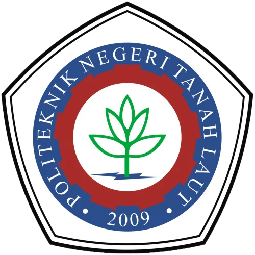

<div align="center">



# Promo Politala

> Modern promotional website for Politeknik Negeri Tanah Laut built with Next.js 16, React 19, and Tailwind CSS

[](https://nextjs.org)
[](https://reactjs.org)
[](https://tailwindcss.com)
[](https://www.typescriptlang.org)

</div>

---

## 📋 About

Promo Politala is a modern, responsive promotional website designed to showcase Politeknik Negeri Tanah Laut (POLITALA). The site provides comprehensive information about the institution's programs, news, gallery, and allows prospective students to register for admissions.

### Key Features

- ✨ **Modern UI/UX** - Clean, professional design with smooth animations
- 📱 **Fully Responsive** - Optimized for desktop, tablet, and mobile devices
- ⚡ **Fast Performance** - Built with Next.js 16 for server-side rendering and optimal performance
- 🎨 **Tailwind CSS** - Utility-first CSS framework for rapid styling
- 🔄 **Dynamic Content** - Structured data management for programs, news, testimonials, and gallery items
- 🤖 **Modern Stack** - React 19 with latest features and improvements
- 📦 **TypeScript** - Full type safety for better development experience

---

## 🚀 Quick Start

### Prerequisites
- Node.js 18+ or higher
- npm, yarn, pnpm, or bun

### Installation

1. **Install dependencies:**
```bash
npm install
# or
yarn install
# or
pnpm install
# or
bun install
```

2. **Run the development server:**
```bash
npm run dev
# or
yarn dev
# or
pnpm dev
# or
bun dev
```

3. **Open your browser:**
Navigate to [http://localhost:3000](http://localhost:3000) to see the application

The application automatically reloads when you make changes to files.

---

## 📁 Project Structure

```
promo-politala/
├── src/
│   ├── app/
│   │   ├── api/              # API routes (chat, etc.)
│   │   ├── about/            # About page
│   │   ├── berita/           # News page
│   │   ├── daftar/           # Registration page
│   │   ├── galeri/           # Gallery page
│   │   ├── kontak/           # Contact page
│   │   ├── prodi/            # Programs page
│   │   ├── globals.css       # Global styles
│   │   ├── layout.jsx        # Root layout
│   │   └── page.jsx          # Home page
│   ├── components/
│   │   ├── Chatbot.jsx       # AI Chatbot component
│   │   ├── Footer.jsx        # Footer component
│   │   ├── Navbar.jsx        # Navigation bar
│   │   └── ui.jsx            # Reusable UI components
│   └── lib/
│       └── data.js           # Content data (programs, news, testimonials, gallery)
├── public/
│   └── logo.webp             # Institution logo
├── next.config.ts            # Next.js configuration
├── tailwind.config.ts        # Tailwind CSS configuration
├── tsconfig.json             # TypeScript configuration
└── package.json              # Project dependencies
```

---

## 🛠️ Build & Production

### Build for Production

```bash
npm run build
# or
yarn build
# or
pnpm build
# or
bun build
```

### Start Production Server

```bash
npm start
# or
yarn start
# or
pnpm start
# or
bun start
```

---

## 📄 Pages

- **Home (`/`)** - Landing page with hero section, featured programs, news, testimonials, and gallery
- **About (`/about`)** - Institution information and overview
- **Programs (`/prodi`)** - Detailed information about academic programs
- **News (`/berita`)** - Latest news and updates
- **Gallery (`/galeri`)** - Photo gallery with filtering options
- **Contact (`/kontak`)** - Contact information and contact form
- **Registration (`/daftar`)** - Student registration form

---

## 🔧 Available Scripts

| Script | Description |
|--------|-------------|
| `npm run dev` | Start development server |
| `npm run build` | Build for production |
| `npm start` | Start production server |
| `npm run lint` | Run ESLint for code quality |

---

## 💡 Technologies Used

- **[Next.js 16.2.4](https://nextjs.org)** - React framework with SSR and SSG
- **[React 19.2.4](https://react.dev)** - Latest React with new features
- **[Tailwind CSS 4](https://tailwindcss.com)** - Utility-first CSS framework
- **[TypeScript 5](https://www.typescriptlang.org)** - Type-safe JavaScript
- **[ESLint 9](https://eslint.org)** - Code quality and consistency

---

## 📚 Learn More

- [Next.js Documentation](https://nextjs.org/docs) - Learn about Next.js features
- [React Documentation](https://react.dev) - React fundamentals and advanced concepts
- [Tailwind CSS Documentation](https://tailwindcss.com/docs) - CSS utility classes
- [TypeScript Handbook](https://www.typescriptlang.org/docs) - TypeScript language features

---

## 🚀 Deployment

### Deploy on Vercel (Recommended)

The easiest way to deploy is using [Vercel](https://vercel.com), the creators of Next.js:

1. Push your code to a Git repository (GitHub, GitLab, or Bitbucket)
2. Visit [vercel.com](https://vercel.com)
3. Import your repository
4. Vercel will automatically detect the Next.js framework and deploy

[Learn more about deploying Next.js](https://nextjs.org/docs/app/building-your-application/deploying)

### Other Deployment Options

- **Docker** - Containerize your application
- **Self-hosted** - Deploy to your own server
- **Other Platforms** - Netlify, AWS, Google Cloud, etc.

---

## 📝 Content Management

Content is managed in [`src/lib/data.js`](src/lib/data.js) and includes:

- **PRODI** - Academic programs and courses
- **BERITA** - News articles and updates
- **TESTIMONI** - Student testimonials
- **GALERI_ITEMS** - Gallery images and descriptions
- **STATS** - Institution statistics

---

## 🤝 Contributing

Contributions are welcome! Feel free to:
- Report bugs and issues
- Suggest improvements
- Submit pull requests

---

## 📄 License

This project is private and proprietary to Politeknik Negeri Tanah Laut.

---

## 📞 Support

For questions, feedback, or support, please contact:
- **Website**: https://politala.ac.id
- **Email**: info@politala.ac.id
- **Phone**: +62 (contact number)

---

<div align="center">

Made with ❤️ for **Politeknik Negeri Tanah Laut**

</div>
